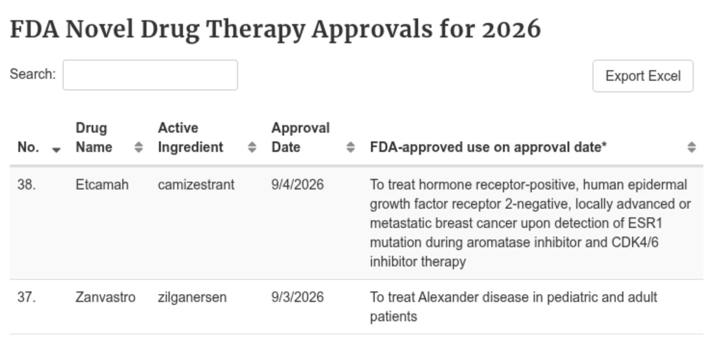
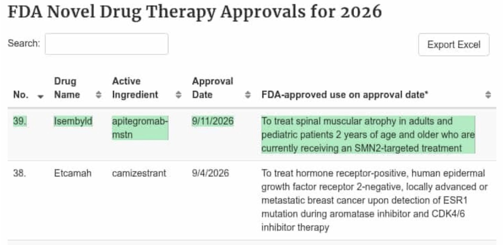
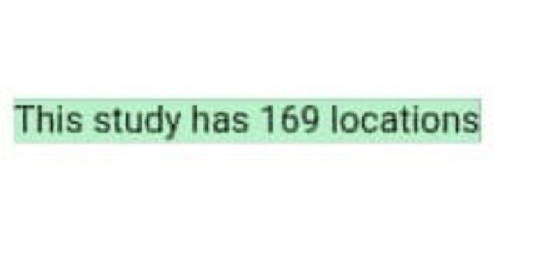
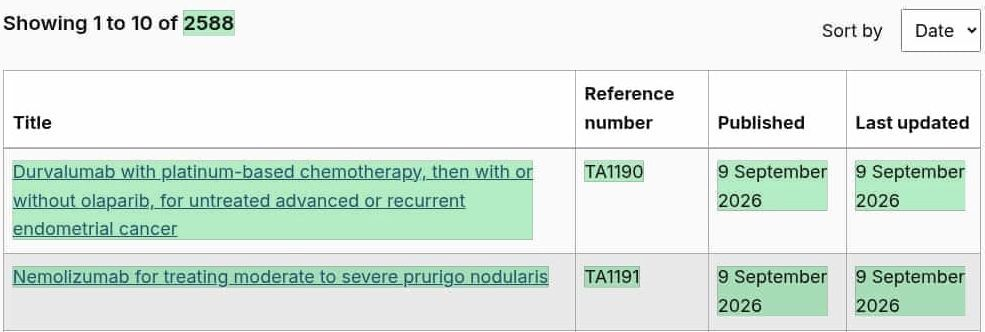
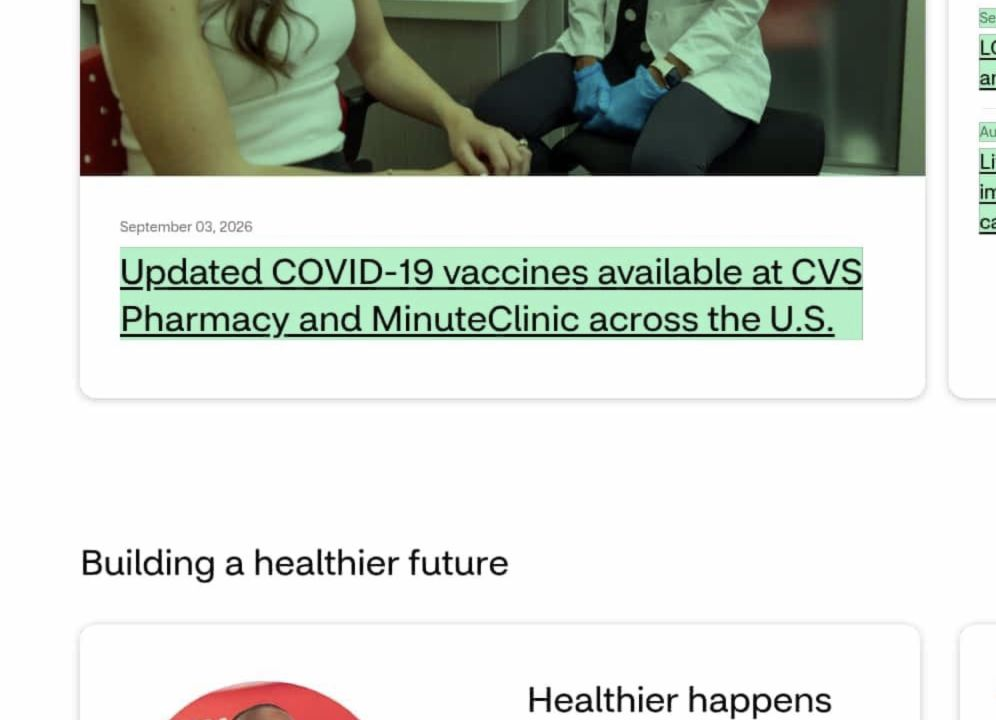

# Check the evidence and the rule

These examples come from the presenter's own monitors of public webpages. The images preserve the original Visualping highlighting. Proposed reviewers and actions are teaching choices. [Source metadata, dates and limitations](evidence/README.md) accompany each example.

## FDA: turn the added entry into a review item

The comparison highlights the new Isembyld row. The saved event was IMPORTANT=true. Open [the fixture](evidence/fixtures/fda-approval.json) and identify which fields describe the source and which are proposed workflow fields.

Check your answer

The source URL, observed time, saved rule, classification and summary belong to the saved event. The source approval date is a separate date. The owner, backup, action and decision are proposed. Confirm the published indication and asset scope before routing. A saved source event does not prove that a reviewer received it or that an M365 flow ran.

## Trial: would your rule include the site change?

The [saved trial fixture](evidence/fixtures/trial-sites.json) reports 171 to 169 sites in its AI Summary. IMPORTANT=false reflects a rule focused on trial status, primary completion, enrollment, arms and primary outcomes. The visible crop shows the later count; the prior value is an attributed AI claim in this compact package.

Check your answer

The rule can legitimately omit site changes. If country or site activity matters to your reviewer, add those fields and test the rule. Keep the saved classification unchanged in the record; put your proposed classification in a separate field. Verify the earlier record before treating the exact count difference as independently checked evidence.

## NICE: what does the list establish?

The [NICE fixture](evidence/fixtures/nice-guidance.json) highlights TA1190 and TA1191 in the first ten results. Its saved AI Summary also calls older entries removed. Decide what you can conclude from this page alone.

Check your answer

The image establishes new entries in the captured list. Older entries leaving the visible first page do not establish withdrawal. Open each linked appraisal to check the recommendation, population and document status. A new listing alone does not establish a positive recommendation.

## Commercial: assign the message edit

The [Pfizer fixture](evidence/fixtures/pfizer-campaign.json) highlights campaign wording. A proposed commercial CI reviewer checks the message against the competitor brief. Decide whether the brief requires every small wording or image edit, and choose delivery accordingly.

The [CVS fixture](evidence/fixtures/cvs-announcement.json) highlights a vaccine-availability announcement. A proposed reviewer opens the announcement and checks product, location and offer details. The listing alone does not establish current local stock.

Separate before captures were unavailable for both commercial examples. Describe the highlighted content and leave exact prior copy unknown. Their saved classification and summary are omitted from this package because they were not verified for inclusion; this does not imply those Visualping fields are absent.
